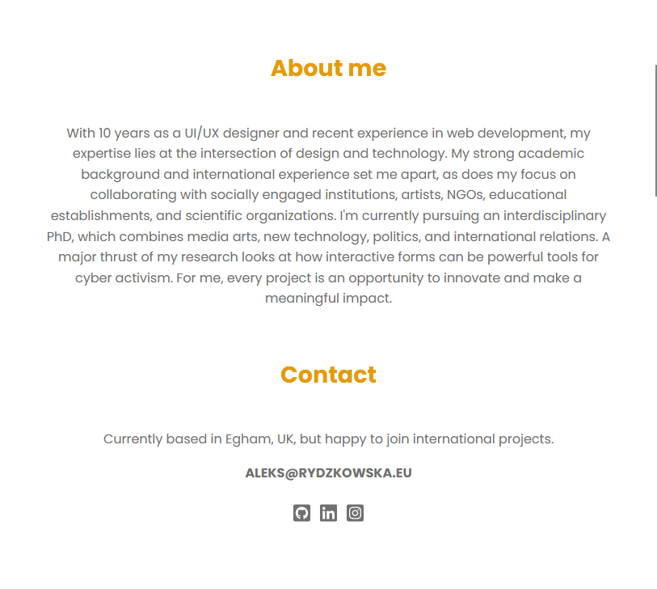
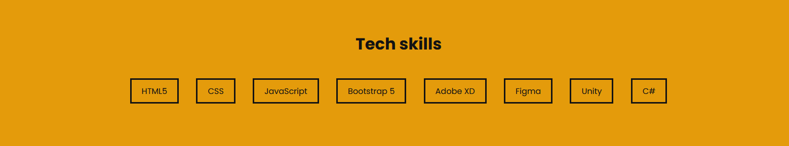
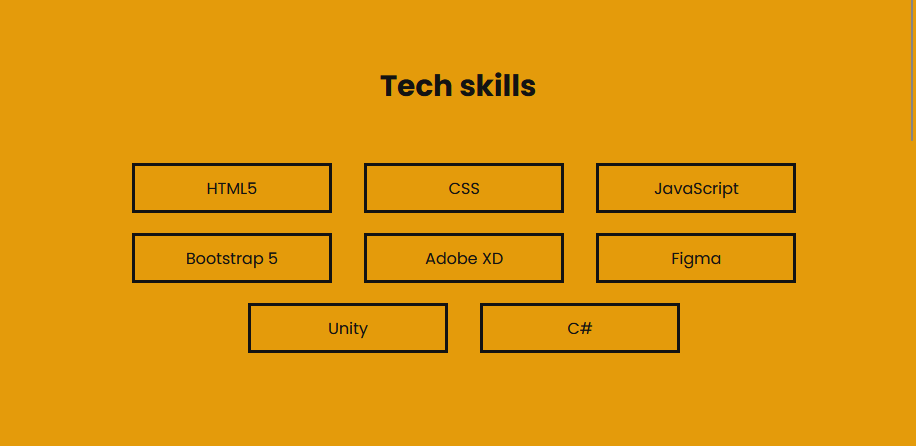
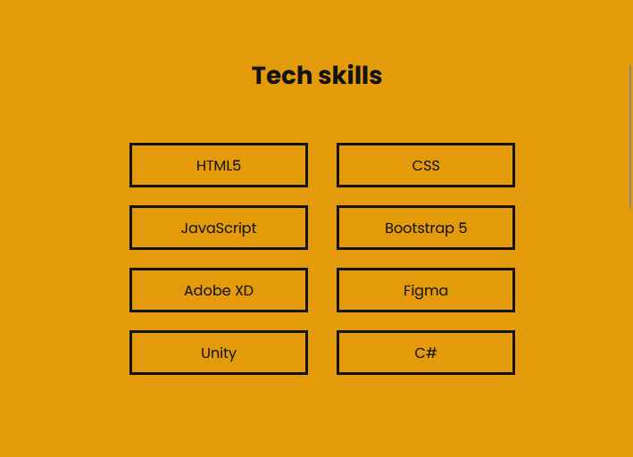
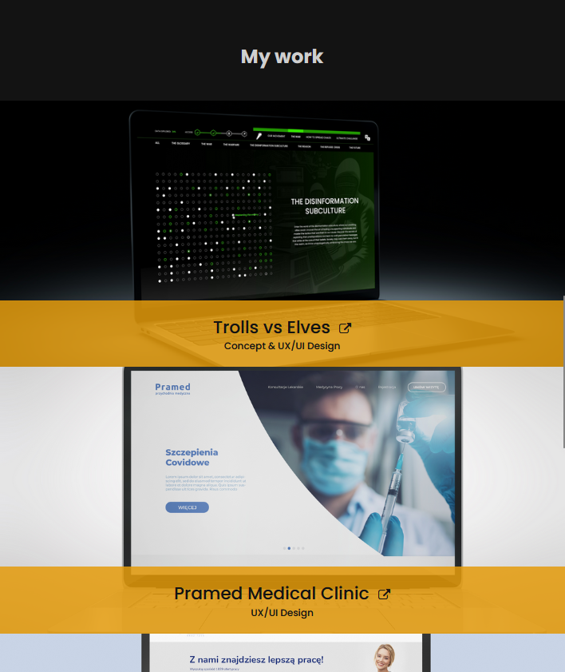

# Bootstrap-portfolio
Welcome to my personal portfolio repository! This project was developed using Bootstrap 5, keeping in mind responsiveness  of the website.

## 🚀 Live Version

Experience the live version of my portfolio: [Click here](https://thevisualriot.github.io/Bootstrap-portfolio/)

## 📝 Description
This project is a code refactor of my previous portfolio. To compare the codes, you can access the previous repository [here](https://github.com/thevisualriot/First-personal-portfolio) or check the deployed version of it [here](https://thevisualriot.github.io/First-personal-portfolio/). The aim of refactor was to use Bootstrap 5 and its elements (jumbotron, navbar, cards, lists and so on) and to make it responsive minimizing the use of media queries.

#### Jumbotron with navbar
A full-width header combined with smooth navigation. Click on a navigation item, and it seamlessly scrolls you to the respective section.

#### About & Contact
The section about me was built using bootstrap grid to ensure responsiveness. On the small screens, two columns are displayed one after another to improve clarity.

> mobile version of About section

#### Skills
The section with my technical skills is a new feature of the portfolio, and was built using Bootstrap list class. To improve the design, all skills are put in boxes that display differently, depending on the screen size.

>Skills section on large screens

>Skills section on medium screens

>Skills section on small screens

#### Work
Work showcase was built using Bootstrap row-column grid, changing the display mode for big and small screens. I kept overlays which, when hovered, display longer description of the projects and act a links that sent users to the deployed applications. On mobile version, the long descriptions is hidden, and the overlay has a fixed size, to make it compatible with touchscreens.

>Work section on small screens

#### Footer
Footer was added in this version of portfolio, and it contains a button with a box shadow on hover, and copyrights information.

> Hover state of the button

## ♿ Accessibility
I'm an advocate for digital inclusivity. With that in mind, this portfolio is built with semantic HTML structures, enhanced with `alt` attributes to boost accessibility.

## 📜 License
This project is licensed under the [MIT License](https://choosealicense.com/licenses/mit/)